# Accessible Form Assistant 🎙️📝

> **Empowering every citizen to navigate, understand, and complete complex government forms independently using Voice AI and Vision.**

[](https://opensource.org/licenses/MIT)
[](https://reactjs.org/)
[](https://nodejs.org/)
[](https://aistudio.google.com/)
[](https://groq.com/)
[](https://www.sarvam.ai/)

---

## 1. Project Title

**Accessible Form Assistant**  
*Voice-First, AI-Powered Multilingual Assistance for Public Services*

The **Accessible Form Assistant** is a mobile-first, voice-guided web application designed to bridge the digital and literacy divide in public administration. By converting physical, bureaucratic government documents into simple, spoken conversational prompts in native Indian languages (English, Tamil, Hindi), the platform empowers elderly, illiterate, and visually impaired citizens to fill out complex forms independently.

---

## 2. Hackathon Overview

### The Core Problem
Across developing nations like India, access to social welfare schemes (Ration Cards, Disability Certificates, Housing Subsidies, Pension Schemes) requires filling out intricate paper or digital forms. Millions of citizens face severe barriers:
- **Literacy & Language Gaps:** Official forms are heavily loaded with legal and bureaucratic jargon in non-native languages.
- **Dependency & Exploitation:** Citizens often rely on paid agents, intermediaries, or family members, exposing themselves to financial exploitation and privacy loss.
- **Form Rejection Rates:** Inaccurate entries caused by misunderstandings lead to repeated office visits and delayed benefits.

### Why Existing Solutions Fall Short
- **Standard Screen Readers:** Read verbatim legal text line-by-line without simplifying complex terms or translating multi-column physical forms.
- **Generic Translation Tools:** Perform literal word-for-word translations that preserve obscure bureaucratic phrases (e.g., translating "Domicile Certificate" literally rather than explaining "Proof of state residence").
- **Kiosk Portals:** Require complex typing skills, dropdown navigation, and desktop-oriented interactions.

### How Accessible Form Assistant Solves It
The Accessible Form Assistant turns physical paper forms into interactive, voice-driven conversations:
1. **Snap & Digitization:** Citizens or kiosk operators upload a photo of any blank form.
2. **AI Vision Extraction:** Google Gemini 3.5 Flash extracts all input fields, labels, types, and document requirements.
3. **Bureaucratic Simplification:** Groq Llama rewrites questions to a 5th-grade reading level.
4. **Multilingual Spoken Guide:** Sarvam AI speaks each question aloud in English, Tamil, or Hindi and listens to spoken responses.
5. **AI Answer Normalization:** Spoken answers like *"twenty third august nineteen ninety"* are automatically converted to standard database formats (`23/08/1990`).
6. **Mobile PDF Handoff:** Generates a completed, print-ready PDF and a QR code for instant mobile downloading at public kiosks.

---

## 3. Key Features

- **📸 Smart Vision Extraction (Google Gemini 3.5 Flash)**  
  Instantly digitizes uploaded paper forms or PDF templates. Detects input field names, input types (`text`, `date`, `number`, `choice`, `signature`), instructions, and required supporting documents despite poor lighting, camera tilt, or low image quality.

- **🗣️ Multilingual Voice Guidance (Sarvam AI & Web Speech API)**  
  Provides native spoken audio for questions, instructions, and hints in **English**, **Tamil (தமிழ்)**, and **Hindi (हिंदी)** using Sarvam AI's `bulbul:v2` TTS model, with seamless fallback to browser Web Speech API.

- **🧠 Bureaucratic Simplification Engine (Groq Llama)**  
  Uses fast LLM inference to translate complex administrative terminology into simple, friendly language suitable for individuals with basic literacy levels.

- **🎙️ Indic Speech Recognition & Answer Normalization (Sarvam Saarika v2.5 + Groq Whisper)**  
  Transcribes spoken answers accurately using Indic Speech-to-Text (`saarika:v2.5`). A secondary AI normalization step converts conversational answers into structured formats (e.g., spoken numbers to digits, spoken dates to `DD/MM/YYYY`).

- **🔒 Zero-Disk Privacy-First Architecture**  
  Built specifically for public kiosk environments. Uploaded images and recordings are processed entirely in server RAM (`multer.memoryStorage()`). No citizen photos, voice clips, or personal data are persisted to disk or databases.

- **📱 Instant Mobile Handoff (QR Code Generation)**  
  Generates a dynamic QR code upon form completion. Kiosk users can scan the code to download the final filled PDF directly to their mobile device without typing URLs or plugging in flash drives.

- **⌨️ Fallback Manual Keyboard Input**  
  Offers an instant toggle to manual typing if speech recognition encounters noisy background environments or audio hardware limitations.

- **🌐 Offline-Resilient Session Storage**  
  Uses React Context synchronized with browser `sessionStorage`, allowing users to refresh pages or briefly lose connectivity without losing form progress.

---

## 4. Demo

- **Live Frontend App:** [https://oosd-form-api.vercel.app](https://oosd-form-api.vercel.app)
- **Live Backend API:** [https://oosd-form-api.onrender.com/api](https://oosd-form-api.onrender.com/api)
- **Demo Video:** [TODO: Add URL]
- **Presentation Deck:** [TODO: Add URL]

---

## 5. Screenshots / Demo

[TODO: Add screenshots of the application]

### Recommended Screenshots to Showcase:
1. **Language & Privacy Selection:** Clean, high-contrast dark-mode interface with native scripts for English, Tamil, and Hindi.
2. **Form Capture & OCR Preview:** Client-side compressed canvas preview during Gemini Vision OCR analysis.
3. **Voice-Guided Questionnaire Loop:** Interactive step-by-step card showing progress bar, simplified field labels, audio waveform animation, and AI normalized output.
4. **Completed Output & QR Mobile Handoff:** Summary screen displaying completed form answers, list of required supporting documents, print action, and live QR code for mobile download.

---

## 6. Problem Statement

### Real-World Challenge
In India and many developing nations, social welfare delivery relies on bureaucratic forms. Millions of eligible citizens fail to receive subsidies, pensions, and identity documents because form filling requires high literacy and administrative familiarity.

### Key Pain Points
- **Jargon Barrier:** Forms use phrases like *"Jurisdictional Revenue Office"* or *"Attested Copy of Domicile"* which confuse citizens.
- **Intermediary Exploitation:** Touts charge ₹200–₹1,000 to fill out free government forms.
- **Errors & Delays:** Incorrectly filled fields result in form rejections and weeks of bureaucratic back-and-forth.
- **Privacy Vulnerability:** Citizens share personal identity numbers and details verbally with third-party form-fillers.

### Target Audience
- Rural citizens with basic or limited literacy.
- Elderly citizens with vision or motor impairments.
- Non-native speakers dealing with state government administration.
- Operators at Common Service Centres (CSCs) and public help desks.

---

## 7. Solution

The **Accessible Form Assistant** transforms a passive form into an active, voice-assisted workflow:

```
[ User Selects Language ] ➡️ [ Privacy Agreement ] ➡️ [ Capture / Upload Form Image ]
                                                                │
                                                                ▼
[ Completed PDF / QR Code ] ◄── [ AI Normalization ] ◄── [ Voice Q&A Loop (TTS/STT) ]
```

### Complete User Journey
1. **Language Selection:** User selects English, Tamil, or Hindi from a high-contrast card UI.
2. **Privacy Notice:** App explicitly displays zero-data retention policies. User accepts.
3. **Form Capture:** User snaps a photo of a blank paper form or uploads a PDF.
4. **AI Processing:**
   - **Google Gemini 3.5 Flash Vision** parses the document image and extracts structured fields.
   - **Groq Llama** simplifies instructions into plain spoken language.
   - **Sarvam AI** translates simplified prompts into the chosen target language.
5. **Interactive Voice Questionnaire:**
   - App speaks question aloud via Sarvam TTS (`bulbul:v2`) or Web Speech API.
   - User speaks answer into microphone.
   - Sarvam STT (`saarika:v2.5`) transcribes audio; Groq Llama normalizes raw speech to structured data.
   - User confirms or re-records.
6. **Output & Handoff:**
   - System populates a print-ready PDF using `pdf-lib`.
   - Generates a QR code for immediate download to the citizen's smartphone.
   - Session state purges cleanly on exit.

---

## 8. Why This Project?

| Criterion | Implementation & Differentiator |
| :--- | :--- |
| **Innovation** | Combines Multi-Modal Vision OCR, LLM Simplification, and Indic Voice Synthesis into a seamless single-page application. |
| **Technical Complexity** | Multi-vendor AI pipeline (Google Gemini + Groq Llama + Sarvam AI) with automatic fallbacks for low-bandwidth / failed voice inputs. |
| **User Experience** | Native language support, glassmorphism UI design system, live visual audio waveforms, and 30-second auto-stop recording timers. |
| **Privacy & Security** | In-memory stream processing with `multer.memoryStorage()`, zero persistent storage of personal images/audio, and 1-hour PDF output auto-purge. |
| **Accessibility** | Built ground-up for screen readers, high-contrast dark theme, touch-friendly tap targets, and full keyboard fallback. |
| **Real-World Applicability** | Immediately deployable at public kiosks, village panchayat offices, and Common Service Centres (CSCs). |

---

## 9. Tech Stack

| Category | Technology | Purpose |
| :--- | :--- | :--- |
| **Frontend Framework** | React 18 + Vite | High-performance single-page web application architecture |
| **Styling & UI Design** | Vanilla CSS (Glassmorphism) | Dark-mode design system with responsive layouts and micro-animations |
| **State Management** | React Context API + `sessionStorage` | App state orchestration with resilience against page refreshes |
| **Audio Capture & Web APIs** | Web MediaDevices API (getUserMedia) | Microphone audio stream recording (`audio/webm` & `audio/mp4`) |
| **Speech Synthesis (Fallback)** | Web Speech API (`SpeechSynthesis`) | In-browser zero-latency text-to-speech fallback |
| **Backend Framework** | Node.js + Express.js (ES Modules) | RESTful API backend handling routing, rate limiting, and AI calls |
| **Backend Middleware** | Helmet, CORS, Express-Rate-Limit | Production HTTP security headers, CORS origin protection, and rate limiting |
| **File Stream Processing** | Multer | RAM-buffered handling (`memoryStorage`) for uploaded images and audio |
| **AI Vision (OCR)** | Google Gemini 3.5 Flash Vision | Document layout parsing, label recognition, and field classification |
| **AI Language / LLM** | Groq API (`compound-beta`) | Bureaucratic jargon simplification and voice answer normalization |
| **AI Indic Voice (STT & TTS)** | Sarvam AI API (`saarika:v2.5`, `bulbul:v2`) | State-of-the-art Speech-to-Text, Text-to-Speech, and Indic translation |
| **STT Fallback** | Groq Whisper (`whisper-large-v3`) | High-accuracy secondary speech-to-text fallback engine |
| **PDF Processing** | `pdf-lib` | Standardized PDF document creation and form template populating |
| **QR Code Generation** | `qrcode.react` & `qrcode` | Client-side and server-side QR rendering for kiosk mobile handoff |
| **Deployment** | Vercel (Frontend) & Render (Backend) | Cloud platform hosting with custom domain and HTTPS routing |

---

## 10. System Architecture

```mermaid
flowchart TD
    User([Citizen / Kiosk Operator]) <--> FE[React 18 + Vite Frontend Application]

    subgraph Frontend_Layer [Frontend Architecture]
        FE --> Cam[Camera Capture & HTML5 Canvas Compression]
        FE --> Rec[Web MediaDevices Audio Recorder]
        FE --> WebTTS[Web Speech API Browser Fallback]
        FE --> QR[QRCode.react Component]
        FE --> Context[AppContext + sessionStorage Engine]
    end

    subgraph Backend_Layer [Express.js Backend API Service]
        BE[Node.js REST API Server]
        BE --> Security[Helmet Header Security & CORS Restrictions]
        BE --> RateLimiter[Express Rate Limiter - 100 req/15min]
        BE --> MulterStorage[Multer MemoryStorage - RAM Processing]
    end

    subgraph AI_Services [Multi-Model AI Infrastructure]
        BE --> GeminiVision[Google Gemini 3.5 Flash Vision API\nOCR & Schema Extraction]
        BE --> GroqLLM[Groq Llama API\n5th-Grade Simplification & Answer Normalization]
        BE --> SarvamSTT[Sarvam AI Saarika v2.5\nIndic Speech-to-Text]
        BE --> GroqWhisper[Groq Whisper v3\nSTT Backup Engine]
        BE --> SarvamTTS[Sarvam AI Bulbul v2\nIndic Text-to-Speech Synthesis]
        BE --> SarvamTranslate[Sarvam AI Translation API\nEnglish to Tamil / Hindi]
    end

    subgraph Document_Engine [Output & Document Generation]
        BE --> PDFGen[pdf-lib Generator Engine\nTemplate Filling & Dynamic PDF Creation]
        BE --> PurgeScheduler[1-Hour File Deletion Scheduler]
    end

    FE <-->|HTTPS / JSON REST APIs| BE
```



### Data Flow Overview
1. **Capture & Compression:** Image captured on frontend is compressed via HTML5 Canvas (max 1280px dimension, 85% JPEG quality) to minimize API bandwidth.
2. **In-Memory Transmission:** Form payload is sent as `multipart/form-data` to `/api/extract`. Express buffers the file in RAM via `multer.memoryStorage()`.
3. **Vision Processing:** Buffer is converted to Base64 and processed by Gemini 3.5 Flash Vision to extract JSON schema containing labels, types, and instructions.
4. **Simplification & Translation:** Groq Llama simplifies the JSON schema to 5th-grade reading level. Sarvam AI translates fields into Tamil or Hindi.
5. **Interactive Audio Loop:**
   - Frontend requests audio synthesis from `/api/tts` (Sarvam AI `bulbul:v2` model with base64 audio response).
   - User voice recording is sent to `/api/stt` (Sarvam AI `saarika:v2.5` STT or Groq Whisper fallback).
   - Raw transcription is sent to `/api/simplify-translate/normalize` to format dates/numbers/names cleanly.
6. **PDF Generation & Cleanup:** Completed responses are rendered into a PDF document via `pdf-lib` at `/api/generate-output`. The output file is served via a download URL and scheduled for automatic deletion after 1 hour.

---

## 11. How It Works

### 1. Document Analysis Pipeline (`extractFieldsWithVision`)
When a form image is submitted:
- **Prompt Architecture:** Enforces strict structured JSON output defining `field_id`, `raw_label`, `field_type`, `raw_instructions`, `required_documents`, and `options`.
- **Fault Tolerance:** Robust regex parsing (`/\{[\s\S]*\}/`) isolates JSON data from LLM responses even if extra markdown text is returned.

### 2. Bureaucratic Simplification & Translation (`simplifyAndTranslate`)
- **Batch Processing:** Sends all fields in a single prompt to Groq Llama to minimize latency and token usage.
- **Indic Translation:** If target language is Tamil or Hindi, field labels and instructions are passed through Sarvam AI's translation API.

### 3. Voice Interaction Loop (`VoiceStage.jsx`)
- **Automatic Question Prompting:** Upon mounting a field, the app reads field label, simplified instructions, and type-specific hints.
- **Audio Waveform & Auto-Stop:** Captures audio through `MediaRecorder`. Provides a 30-second visual countdown timer and automatically stops recording upon reaching zero.
- **Dual-Model STT Handling:** Tries Sarvam AI `saarika:v2.5` first. If silent or clipped audio triggers hallucination filters (e.g. repeated "thank you"), it automatically falls back to Groq `whisper-large-v3`.

### 4. Answer Normalization (`normalizeAnswer`)
- Converts raw voice transcripts into standardized representations:
  - `"twenty third august nineteen ninety"` ➡️ `23/08/1990`
  - `"twelve thousand five hundred"` ➡️ `12500`
  - Choice inputs ➡️ Exact matching option string

### 5. Document Output Assembly (`pdf-generator.js`)
- Checks if the form matches known PDF templates (`disability_certificate`, `ration_card`). If present, populates PDF form fields using `pdf-lib`.
- If no template is matched, dynamically generates a clean, structured summary PDF containing filled fields and a consolidated checklist of required supporting documents.

---

## 12. Project Structure

```
oosd-form-api/
├── backend/
│   ├── routes/
│   │   ├── extract.js              # POST /api/extract - Gemini vision OCR
│   │   ├── simplify-translate.js   # POST /api/simplify-translate & /normalize
│   │   ├── stt.js                  # POST /api/stt - Sarvam & Groq STT
│   │   ├── tts.js                  # POST /api/tts - Sarvam TTS with browser fallback
│   │   ├── output.js               # POST /api/generate-output - PDF generator
│   │   └── session.js              # DELETE & POST /api/session - Lifecycle management
│   ├── utils/
│   │   ├── llm.js                  # Gemini Vision & Groq Llama wrappers
│   │   ├── stt.js                  # Sarvam Saarika v2.5 & Groq Whisper handler
│   │   ├── tts.js                  # Sarvam Bulbul v2 audio synthesis & cache
│   │   └── pdf-generator.js        # pdf-lib template filling & simple PDF builder
│   ├── templates/                  # Pre-mapped government form PDF templates
│   │   └── template-config.example.json
│   ├── uploads/                    # Temporary audio uploads (deleted immediately)
│   ├── outputs/                    # Temporary generated PDFs (deleted after 1h)
│   ├── .env                        # Local environment configuration (git ignored)
│   ├── .env.example                # Template environment configuration
│   ├── package.json                # Backend dependencies and scripts
│   └── server.js                   # Express application entrypoint
├── frontend/
│   ├── public/                     # Static web assets
│   ├── src/
│   │   ├── components/
│   │   │   ├── CaptureStage.css    # Styles for camera capture & file picker
│   │   │   ├── CaptureStage.jsx    # Photo capture, upload & canvas compression
│   │   │   ├── LanguageSelector.css# Styles for language selection screen
│   │   │   ├── LanguageSelector.jsx# Native language picker (EN, TA, HI)
│   │   │   ├── NetworkStatus.css   # Styles for offline banner
│   │   │   ├── NetworkStatus.jsx   # Online/offline connectivity notification
│   │   │   ├── OutputStage.css     # Styles for final summary & QR screen
│   │   │   ├── OutputStage.jsx     # PDF download, QR code handoff & summary
│   │   │   ├── PrivacyNotice.css   # Styles for privacy agreement
│   │   │   ├── PrivacyNotice.jsx   # Data protection consent screen
│   │   │   ├── ProcessingStage.css # Styles for processing loading states
│   │   │   ├── ProcessingStage.jsx # AI extraction loading animations
│   │   │   ├── VoiceStage.css      # Styles for voice assistant interface
│   │   │   └── VoiceStage.jsx      # Voice-guided questionnaire loop
│   │   ├── contexts/
│   │   │   └── AppContext.jsx      # Global state + sessionStorage persistence
│   │   ├── hooks/
│   │   │   ├── useAudioRecorder.js # WebRTC microphone capture hook
│   │   │   └── useSpeechSynthesis.js # Hybrid TTS hook (Sarvam AI + Web Speech API)
│   │   ├── utils/
│   │   │   └── api.js              # Axios API client methods
│   │   ├── App.css                 # Glassmorphism & layout styles
│   │   ├── App.jsx                 # Stage-based main router component
│   │   ├── index.css               # Design system tokens & base CSS
│   │   └── main.jsx                # React DOM entrypoint
│   ├── index.html                  # HTML5 boilerplate & meta tags
│   ├── package.json                # Frontend dependencies and Vite scripts
│   ├── vercel.json                 # Vercel deployment rewrite rules
│   └── vite.config.js              # Vite build configuration
├── shared/
│   └── types.ts                    # Shared TypeScript interface definitions
├── .gitignore                      # Git ignored files configuration
├── LICENSE                         # MIT License file
├── package.json                    # Root workspace package configuration
├── setup.bat                       # Automated Windows setup script
├── start.bat                       # Automated concurrent start script
└── README.md                       # Project documentation
```

### Detailed Component Overview
- **`backend/server.js`**: Configures Express, CORS whitelist, Helmet headers, rate limiting (100 req / 15 mins), and mounts API endpoints.
- **`backend/utils/llm.js`**: Core AI bridge integrating Google Gemini Vision (`gemini-3.5-flash-lite`), Groq Llama LLM (`compound-beta`), and Sarvam translation.
- **`backend/utils/stt.js`**: Implements Sarvam STT (`saarika:v2.5`) with automatic fallback to Groq Whisper (`whisper-large-v3`).
- **`backend/utils/tts.js`**: Manages Sarvam TTS (`bulbul:v2`) audio synthesis and includes a 1-hour in-memory cache map for common prompts.
- **`frontend/src/contexts/AppContext.jsx`**: Central React context managing active stage (`language` | `privacy` | `capture` | `extracting` | `simplifying` | `voice` | `output`), active language, and session resilience.

---

## 13. Installation

### Prerequisites
- **Node.js**: v18.0.0 or higher
- **npm**: v9.0.0 or higher
- **API Keys**:
  - [Google Gemini API Key](https://aistudio.google.com/app/apikey) (for Vision OCR)
  - [Groq API Key](https://console.groq.com/keys) (for LLM simplification & normalization)
  - [Sarvam AI API Key](https://www.sarvam.ai/) (for Indic STT, TTS, and Translation)

### Step 1: Clone the Repository
```bash
git clone https://github.com/Vickyy-Ft/oosd-form-api.git
cd oosd-form-api
```

### Step 2: Automated One-Click Setup (Windows)
```cmd
setup.bat
```
*This script verifies Node.js, installs all root, backend, and frontend dependencies, and creates `backend\.env` from template.*

### Manual Installation (All Operating Systems)
```bash
# Install root dependencies
npm install

# Install backend and frontend dependencies concurrently
npm run install:all
```

### Step 3: Configure Environment Variables
Create a `.env` file in the `backend/` directory (see Section 14).

### Step 4: Run Development Servers
```bash
# Launch both backend and frontend concurrently
npm start
```
*Alternatively, run `start.bat` on Windows.*

The application will be accessible at:
- **Frontend App:** `http://localhost:5173`
- **Backend API:** `http://localhost:3001`
- **Backend Health Check:** `http://localhost:3001/api/health`

---

## 14. Environment Variables

Create `backend/.env` based on `backend/.env.example`:

```env
# Server Configuration
PORT=3001
NODE_ENV=development
FRONTEND_URL=http://localhost:5173

# Groq API Configuration (Simplification, Normalization & STT Fallback)
GROQ_API_KEY=your_groq_api_key_here

# Google Gemini API Configuration (Vision OCR & Form Parsing)
GEMINI_API_KEY=your_gemini_api_key_here

# Sarvam AI Configuration (Indic STT, TTS & Translation)
SARVAM_API_KEY=your_sarvam_api_key_here

# Session & File Upload Limits
SESSION_TIMEOUT_MS=3600000
MAX_FILE_SIZE_MB=10
```

### Variable Details
| Variable | Description | Default / Example | Required |
| :--- | :--- | :--- | :--- |
| `PORT` | Local port for Express backend server | `3001` | Yes |
| `NODE_ENV` | Environment mode (`development` or `production`) | `development` | Yes |
| `FRONTEND_URL` | Allowed origin for CORS configuration | `http://localhost:5173` | Yes |
| `GROQ_API_KEY` | Secret API key for Groq Llama & Whisper | `gsk_...` | Yes |
| `GEMINI_API_KEY` | Secret API key for Google Gemini 3.5 Flash | `AQ....` | Yes |
| `SARVAM_API_KEY` | Subscription key for Sarvam AI Indic services | `sk_...` | Yes |
| `SESSION_TIMEOUT_MS` | Max session timeout in milliseconds | `3600000` (1 hour) | No |
| `MAX_FILE_SIZE_MB` | Maximum allowed image/audio upload size | `10` (MB) | No |

*Note: Never commit your `.env` file containing active secrets to public version control.*

---

## 15. Usage

### Step-by-Step Walkthrough

#### 1. Language Selection
Launch the app at `http://localhost:5173`. Click on your preferred language card: **English**, **தமிழ் (Tamil)**, or **हिंदी (Hindi)**.

#### 2. Privacy Confirmation
Read the zero-data retention notice and click **"I Understand & Agree"**.

#### 3. Upload Form Image
Click **"Take Photo"** (mobile camera) or **"Upload File"** (select image/PDF). Choose a sample government application form.

#### 4. Automated Processing
The system automatically:
- Compresses the image client-side.
- Performs Vision OCR via Google Gemini 3.5 Flash.
- Rewrites form prompts into simplified language.
- Translates content into the selected language.

#### 5. Interactive Voice Completion
For each detected form field:
- **Listen:** Click **"Listen"** (or let auto-play read) to hear the simplified question and hint in native audio.
- **Record:** Click **"Record Answer"** and speak your response into the microphone (e.g., *"My name is Ramesh Kumar"* or *"Twenty fifth May nineteen eighty five"*).
- **Auto-Normalization:** View the transcribed speech and the AI-structured output (e.g., `25/05/1985`).
- **Confirm:** Click **"Confirm"** to lock in the answer and advance to the next field. Alternatively, click **"Re-record"** or switch to **"Type answer manually"**.

#### 6. Summary & Mobile Handoff
Upon completing all fields:
- Download the generated PDF directly to your device.
- Scan the live **QR Code** using any mobile phone camera to download the PDF instantly.
- Review the consolidated list of **Required Documents** to attach before submission.

---

## 16. API Documentation

### 1. Health Check
- **Endpoint:** `GET /api/health`
- **Authentication:** None
- **Response:**
  ```json
  {
    "status": "healthy",
    "timestamp": "2026-08-23T17:36:38.000Z",
    "version": "1.0.0"
  }
  ```

### 2. Extract Form Fields (Vision OCR)
- **Endpoint:** `POST /api/extract`
- **Content-Type:** `multipart/form-data`
- **Request Parameters:**
  - `image`: File (JPEG, PNG, WebP, PDF up to 10MB)
- **Response:**
  ```json
  {
    "success": true,
    "formData": {
      "form_id": "disability_certificate_application",
      "fields": [
        {
          "field_id": "field_001",
          "raw_label": "Full Name of Applicant",
          "field_type": "text",
          "raw_instructions": "Enter name as recorded in Aadhaar card",
          "required_documents": ["Aadhaar Card"],
          "options": []
        },
        {
          "field_id": "field_002",
          "raw_label": "Date of Birth",
          "field_type": "date",
          "raw_instructions": "Format DD/MM/YYYY",
          "required_documents": ["Birth Certificate or School TC"],
          "options": []
        }
      ]
    }
  }
  ```

### 3. Simplify and Translate Fields
- **Endpoint:** `POST /api/simplify-translate`
- **Content-Type:** `application/json`
- **Request Body:**
  ```json
  {
    "formData": { "form_id": "disability_certificate_application", "fields": [...] },
    "language": "tamil"
  }
  ```
- **Response:**
  ```json
  {
    "success": true,
    "formData": {
      "form_id": "disability_certificate_application",
      "fields": [
        {
          "field_id": "field_001",
          "raw_label": "Full Name of Applicant",
          "simplified_label": "விண்ணப்பதாரரின் முழு பெயர்",
          "simplified_instructions": "ஆதார் கார்டில் உள்ளது போல் பெயர் எழுதவும்",
          "field_type": "text"
        }
      ]
    }
  }
  ```

### 4. Normalize Voice Answer
- **Endpoint:** `POST /api/simplify-translate/normalize`
- **Content-Type:** `application/json`
- **Request Body:**
  ```json
  {
    "transcript": "twenty third august nineteen ninety",
    "fieldLabel": "Date of Birth",
    "fieldType": "date"
  }
  ```
- **Response:**
  ```json
  {
    "success": true,
    "normalized": "23/08/1990"
  }
  ```

### 5. Text-to-Speech (TTS)
- **Endpoint:** `POST /api/tts`
- **Content-Type:** `application/json`
- **Request Body:**
  ```json
  {
    "text": "உங்கள் பிறந்த தேதியை கூறுங்கள்",
    "language": "tamil"
  }
  ```
- **Response (Sarvam AI Success):**
  ```json
  {
    "success": true,
    "audioContent": "UklGRiQAAABXQVZFZm10IBAAAAABAAEA...",
    "mockAudio": false
  }
  ```
- **Response (Browser Fallback Metadata):**
  ```json
  {
    "success": true,
    "browserTTS": true,
    "mockAudio": true,
    "text": "Tell your date of birth",
    "language": "english",
    "lang": "en-IN",
    "rate": 1.0,
    "pitch": 1.0
  }
  ```

### 6. Speech-to-Text (STT)
- **Endpoint:** `POST /api/stt`
- **Content-Type:** `multipart/form-data`
- **Request Parameters:**
  - `audio`: Audio File (`audio/webm`, `audio/wav`, `audio/mp4` up to 25MB)
  - `language`: String (`english` | `tamil` | `hindi`)
- **Response:**
  ```json
  {
    "success": true,
    "transcription": "Ramesh Kumar",
    "confidence": 1.0
  }
  ```

### 7. Generate Output PDF
- **Endpoint:** `POST /api/generate-output`
- **Content-Type:** `application/json`
- **Request Body:**
  ```json
  {
    "formData": { "form_id": "disability_certificate", "fields": [...] },
    "language": "english"
  }
  ```
- **Response:**
  ```json
  {
    "success": true,
    "output_type": "pdf",
    "download_url": "/api/downloads/disability_certificate_filled_1740265600000.pdf",
    "filename": "disability_certificate_filled_1740265600000.pdf"
  }
  ```

### 8. Download Output File
- **Endpoint:** `GET /api/downloads/:filename`
- **Authentication:** None
- **Behavior:** Serves the generated PDF file with HTTP header `Content-Disposition: attachment`.

### 9. Session Management
- **Endpoint:** `DELETE /api/session/:sessionId` — Cleans up session records.
- **Endpoint:** `POST /api/session/keepalive` — Confirms active session state.

---

## 17. Database

### Zero-Database Serverless Architecture
To protect citizen privacy and eliminate data liability in public kiosk environments, **the Accessible Form Assistant intentionally does not use a persistent database (SQL or NoSQL).**

- **Ephemeral Processing:** Uploaded images and voice recordings are processed in RAM buffers (`multer.memoryStorage()`).
- **Session State:** Held exclusively in the client's browser using React Context synchronized with `sessionStorage`.
- **Output Storage:** Generated PDF files are temporarily stored in `backend/outputs/` and automatically unlinked from the filesystem after 1 hour by a Node.js `setTimeout` scheduler.

---

## 18. AI/ML Implementation

### 1. Google Gemini 3.5 Flash Vision (`gemini-3.5-flash-lite`)
- **Role:** Optical Character Recognition (OCR) and layout decomposition.
- **Input:** JPEG/PNG base64 image buffer.
- **Output:** Form metadata JSON structure.
- **Prompt Strategy:** Low temperature (`0.1`) with explicit schema definitions and error inference for skewed/noisy photos.

### 2. Groq Llama Models (`compound-beta`)
- **Role 1 (Simplification):** Translates complex legal text to a 5th-grade reading level.
- **Role 2 (Normalization):** Context-aware post-processing that maps spoken strings (e.g. *"fifth of July ninety two"*) into strict form formats (`05/07/1992`).
- **Performance:** Low-latency inference (<500ms) over Groq's LPU infrastructure.

### 3. Sarvam AI Indic Engine
- **Speech-to-Text (`saarika:v2.5`):** Specialized Indic STT model trained on Indian accents, dialects, and code-mixed speech (e.g., Hinglish/Tanglish). Includes built-in filters to drop silence hallucinations.
- **Text-to-Speech (`bulbul:v2`):** High-naturalness Indic neural voice synthesis (`anushka` speaker, 24kHz sampling rate).
- **Translation Engine:** Translates simplified English labels into formal regional language equivalents (`ta-IN` Tamil, `hi-IN` Hindi).

### 4. Groq Whisper Fallback (`whisper-large-v3`)
- **Role:** Secondary speech recognition fallback activated automatically if Sarvam AI endpoint returns empty or fails.

---

## 19. Security

- **Zero-Disk In-Memory Uploads:** `multer.memoryStorage()` processes citizen photos directly in server RAM, preventing physical hard drive storage.
- **Automatic Output Purging:** Generated PDF files are deleted automatically after 60 minutes (`fs.unlink`).
- **Security HTTP Headers (Helmet):** Enforces Content Security Policy (CSP), hides Express headers, and configures Cross-Origin Resource Policy.
- **CORS Protection:** Restricts backend API access strictly to configured frontend domains (`FRONTEND_URL`, `http://localhost:5173`, `https://oosd-form-api.vercel.app`).
- **Rate Limiting:** Protects backend endpoints against brute-force and Denial-of-Service attacks (100 requests per 15-minute window per IP).
- **Client-Side Image Compression:** Canvas API downscales uploaded photos on the user device before network transmission, securing payloads and saving bandwidth.
- **Clean Session Teardown:** Closing the browser tab or clicking **"Decline"** immediately executes `sessionStorage.clear()`.

---

## 20. Testing

### Manual Testing Workflow
Currently, the codebase relies on manual integration testing for hardware audio and vision APIs.

#### Recommended Test Suite Scenarios:
1. **Form Extraction Test:** Upload sample government forms (JPEG/PNG/PDF) and verify field extraction JSON.
2. **Language Switch Test:** Switch between English, Tamil, and Hindi; verify TTS speech output and UI text.
3. **Voice Answer Normalization Test:** Speak dates, numbers, and long names; verify correct conversion in the input card.
4. **Offline Resilience Test:** Disconnect network during voice stage; confirm `NetworkStatus.jsx` banner alerts user gracefully.
5. **QR Code Handoff Test:** Scan output QR code with a smartphone camera and confirm PDF download.

#### Run Test Command
```bash
npm test
```
*Note: Unit tests can be added using Vitest (Frontend) and Supertest (Backend).*

---

## 21. Deployment

### Frontend Deployment (Vercel)
The frontend is pre-configured for Vercel deployment via `frontend/vercel.json`.

1. **Build Command:** `npm run build`
2. **Output Directory:** `dist`
3. **Environment Variable:**
   ```env
   VITE_API_BASE_URL=https://oosd-form-api.onrender.com/api
   ```
4. **Vercel Route Rewrite (`vercel.json`):**
   ```json
   {
     "rewrites": [
       { "source": "/(.*)", "destination": "/index.html" }
     ]
   }
   ```

### Backend Deployment (Render / Railway / DigitalOcean)
The backend is ready for Node.js platform deployment.

1. **Build Command:** `npm install`
2. **Start Command:** `npm start` (or `node server.js`)
3. **Environment Variables to Set in Hosting Dashboard:**
   ```env
   PORT=3001
   NODE_ENV=production
   FRONTEND_URL=https://oosd-form-api.vercel.app
   GROQ_API_KEY=your_production_groq_key
   GEMINI_API_KEY=your_production_gemini_key
   SARVAM_API_KEY=your_production_sarvam_key
   ```

---

## 22. Performance & Scalability

- **HTML5 Canvas Downsampling:** Client-side resizing reduces 12MB phone camera captures down to ~300KB JPEGs, cutting Gemini Vision processing latency by up to 70%.
- **Audio Cache Map (`ttsCache`):** In-memory Map caches Sarvam AI TTS audio buffers for 1 hour, avoiding duplicate API calls for standard system prompts.
- **Groq LPU Acceleration:** Fast token throughput (<500ms) for field simplification and answer normalization.
- **Stateless Horizontal Scaling:** Because state is held in client `sessionStorage` and file storage is ephemeral, backend nodes can be scaled horizontally behind a load balancer without sticky sessions.

---

## 23. Challenges & Technical Decisions

| Challenge | Engineering Decision & Solution |
| :--- | :--- |
| **High Latency in Vision OCR** | Implemented client-side HTML5 canvas downsampling to 1280px max dimension before uploading to Gemini Vision. |
| **Browser Compatibility in Audio Recording** | Addressed Safari iOS `MediaRecorder` limitations by auto-detecting MIME types (`audio/webm` vs `audio/mp4`). |
| **STT Silence Hallucinations** | Sarvam AI STT occasionally returned `"thank you"` on silence clips. Added string normalization filters and auto-fallback to Groq Whisper. |
| **Complex Indian Accent Pronunciations** | Implemented Groq Llama post-processing to clean up raw phonetic transcriptions into standardized dates and names. |
| ** kIosk Mobile Handoff** | Added `qrcode.react` to generate dynamic HTTP links allowing citizens to download completed PDFs directly to their phones. |

---

## 24. Future Improvements

- **📶 Offline-First Edge AI:** Integrate WebAssembly-based Whisper (Whisper.cpp) and local LLMs (Ollama/Transformers.js) for zero-internet rural deployment.
- **✍️ Digital Canvas Signature:** Add a touch-screen signature pad component for direct digital signing.
- **🌐 Expanded Language Support:** Add support for additional Indic languages including Telugu, Marathi, Bengali, Kannada, and Gujarati.
- **📄 Multi-Page Document Support:** Extend Gemini vision prompt pipeline to stitch multi-page government form booklets.
- **📱 Progressive Web App (PWA):** Add service workers and web app manifests for full mobile home-screen installation.

---

## 25. Roadmap

- [x] Core React Frontend & Express Backend Architecture
- [x] Multilingual Support (English, Tamil, Hindi)
- [x] Vision OCR Form Parsing via Google Gemini 3.5 Flash
- [x] Bureaucratic Simplification via Groq Llama
- [x] Indic Voice Synthesis & STT via Sarvam AI
- [x] Conversational Answer Normalization
- [x] Privacy-First Zero-Disk Memory Buffering
- [x] PDF Output Generation & Mobile QR Handoff
- [ ] Digital Signature Canvas Integration
- [ ] Offline WebAssembly AI Engine Fallback
- [ ] Support for Additional Regional Languages (Telugu, Bengali, Marathi)
- [ ] Multi-Page Document Stitching

---

## 26. Team

| Name | Role | Contribution |
| :--- | :--- | :--- |
| **[Team Member 1 Name]** | Full-Stack Developer | Lead React Frontend, Glassmorphism UI, & API Client Integration |
| **[Team Member 2 Name]** | AI & Backend Engineer | Node.js Express Server, Gemini Vision & Sarvam AI Pipeline |
| **[Team Member 3 Name]** | Product & Accessibility Lead | UX Accessibility, Multilingual Prompt Engineering, & PDF Generator |

---

## 27. Hackathon Submission

### ⚡ 30-Second Judge Summary
- **Problem:** Millions of citizens struggle to fill out complex government forms due to literacy, language, and jargon barriers.
- **Solution:** A voice-first AI assistant that scans paper forms, simplifies questions into simple spoken native language (English/Tamil/Hindi), and fills out the PDF via voice.
- **Key Innovation:** Zero-disk privacy architecture combined with multi-model AI (Google Gemini Vision + Groq Llama + Sarvam Indic Voice).
- **Tech Stack:** React 18, Vite, Node.js, Express, Google Gemini, Groq, Sarvam AI, `pdf-lib`.
- **Live Demo:** [https://oosd-form-api.vercel.app](https://oosd-form-api.vercel.app)
- **Repository:** [https://github.com/Vickyy-Ft/oosd-form-api](https://github.com/Vickyy-Ft/oosd-form-api)

---

## 28. Impact

- **Empowering Literacy Independence:** Enables citizens to apply for public benefits without relying on paid agents or touts.
- **Reducing Administrative Rejections:** AI answer normalization reduces rejected applications caused by format errors.
- **Promoting Digital Inclusion:** Brings state-of-the-art Voice AI to underserved linguistic communities.

---

## 29. License

This project is open-source and available under the [MIT License](LICENSE).

```
MIT License

Copyright (c) 2026 Accessible Form Assistant Contributors

Permission is hereby granted, free of charge, to any person obtaining a copy
of this software and associated documentation files (the "Software"), to deal
in the Software without restriction, including without limitation the rights
to use, copy, modify, merge, publish, distribute, sublicense, and/or sell
copies of the Software, and to permit persons to whom the Software is
furnished to do so, subject to the following conditions:

The above copyright notice and this permission notice shall be included in all
copies or substantial portions of the Software.
```

---

## 30. Contributing

Contributions are welcome! Please follow these steps:

1. **Fork the Repository:** Click the **Fork** button on GitHub.
2. **Create a Feature Branch:**
   ```bash
   git checkout -b feature/amazing-feature
   ```
3. **Commit Your Changes:**
   ```bash
   git commit -m "Add amazing feature"
   ```
4. **Push to the Branch:**
   ```bash
   git push origin feature/amazing-feature
   ```
5. **Open a Pull Request:** Describe your changes and submit for review.

---

## 31. Acknowledgements

- **Google Gemini API:** High-fidelity vision OCR document parsing.
- **Groq Cloud:** Lightning-fast Llama inference and Whisper STT fallback.
- **Sarvam AI:** Breakthrough Indic speech-to-text, text-to-speech, and translation models.
- **pdf-lib:** Open-source JavaScript PDF manipulation library.
- **Vite & React Teams:** Next-generation frontend tooling.

---

## 32. Contact

- **GitHub Repository:** [https://github.com/Vickyy-Ft/oosd-form-api](https://github.com/Vickyy-Ft/oosd-form-api)
- **Live Demo App:** [https://oosd-form-api.vercel.app](https://oosd-form-api.vercel.app)
- **Project Lead Email:** [TODO: Add Email]
- **LinkedIn:** [TODO: Add LinkedIn]
- **Website:** [TODO: Add Website]

---
*Built with ❤️ for Digital Inclusion & Universal Accessibility.*
